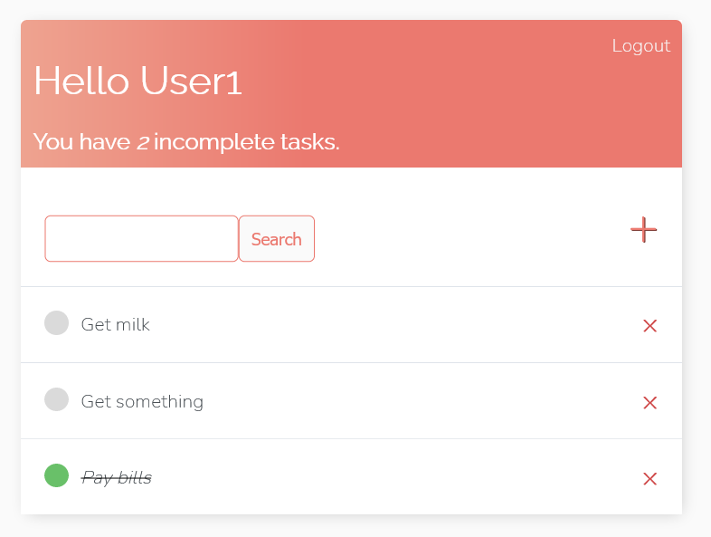
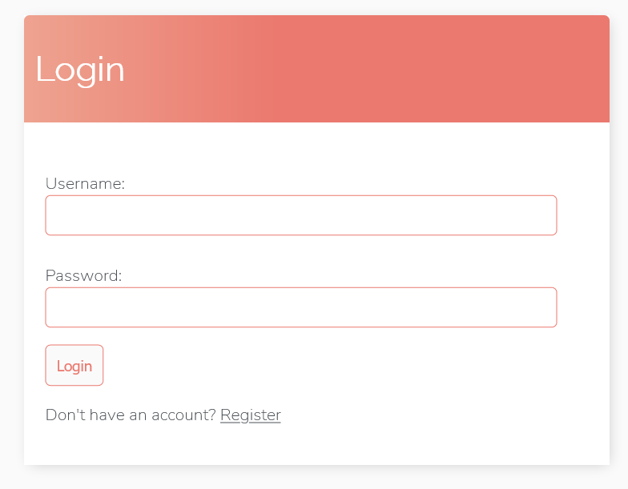
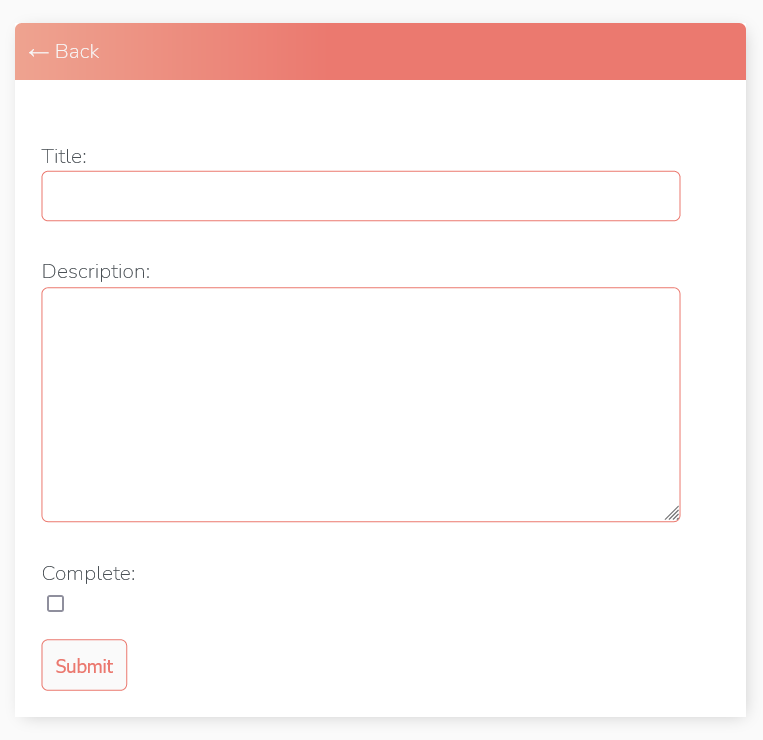

# ToDo<br />
## Main page


## Login page


## Create task


# Download & Setup Instructions :
* Clone the project. This will download the GitHub respository files onto your local machine.</br>
```Shell
git clone https://github.com/teredet/ToDo
```
* Create a virtual environment and activate
```Shell
    pip install virtualenv
    python -m virtualenv envname
    envname\scripts\activate
```
* Install requirements
```Shell
    cd ToDo
    pip install -r requirements.txt
```
* Run program
```Shell
    python manage.py runserver
```

# Features
* registration / authorization;
* creating / viewing / editing tasks;
* Search
# Tech Stack
* Python
* Django
* SQLite